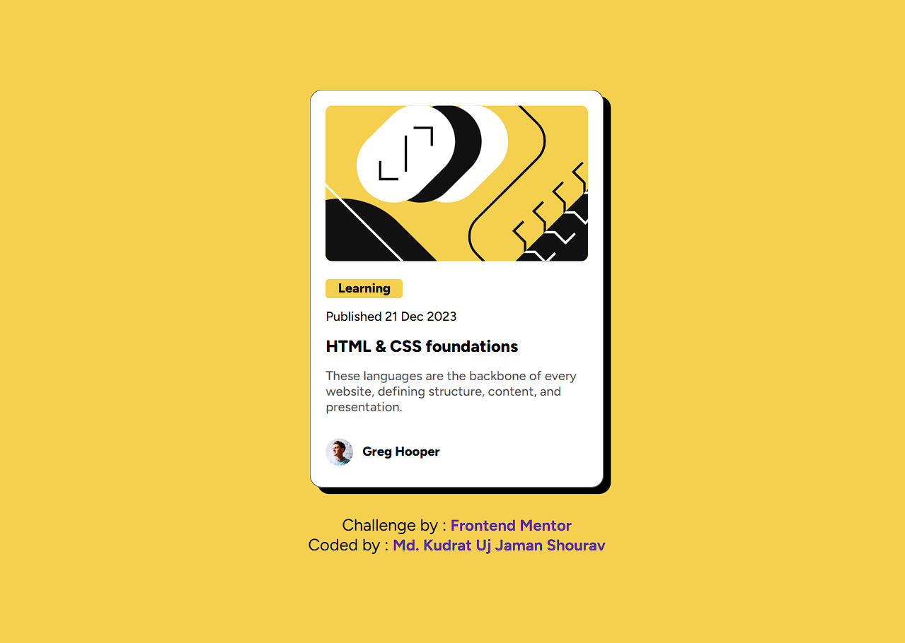

# Frontend Mentor - Blog preview card solution

This is a solution to the [Blog preview card challenge on Frontend Mentor](https://www.frontendmentor.io/challenges/blog-preview-card-ckPaj01IcS). Frontend Mentor challenges help you improve your coding skills by building realistic projects. 

## Table of contents

- [Overview](#overview)
  - [The challenge](#the-challenge)
  - [Screenshot](#screenshot)
  - [Links](#links)
- [My process](#my-process)
  - [Built with](#built-with)
  - [What I learned](#what-i-learned)
  - [AI Collaboration](#ai-collaboration)
- [Author](#author)

## Overview

### The challenge

Users should be able to:

- See hover and focus states for all interactive elements on the page

### Screenshot

### Links

- Solution URL: [solution](https://www.frontendmentor.io/solutions/blog-card-using-html-and-css-1V2Q6M3PBq)
- Live Site URL: [live site](https://blog-cardproject.netlify.app/)

## My process

### Built with

- Semantic HTML5 markup
- CSS custom properties
- Flexbox

### What I learned

This particular project helped me learn more about css properties especially size control. I also learned how to use box shadow to make design more professional.

### AI Collaboration

Describe how you used AI tools (if any) during this project. This helps demonstrate your ability to work effectively with AI assistants.

- chapgpt
- I used it to learn how to fix sizes and put box shadow
- it worked well

## Author

- Frontend Mentor - [@shouravjaman](https://www.frontendmentor.io/profile/yourusername)

